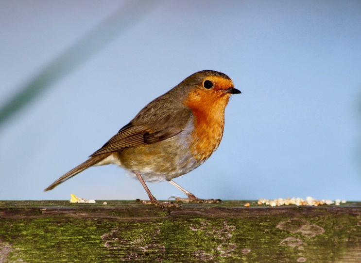
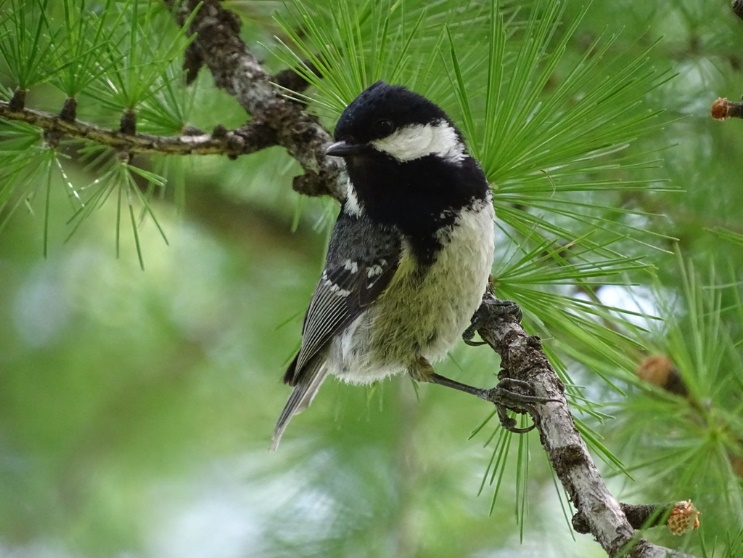
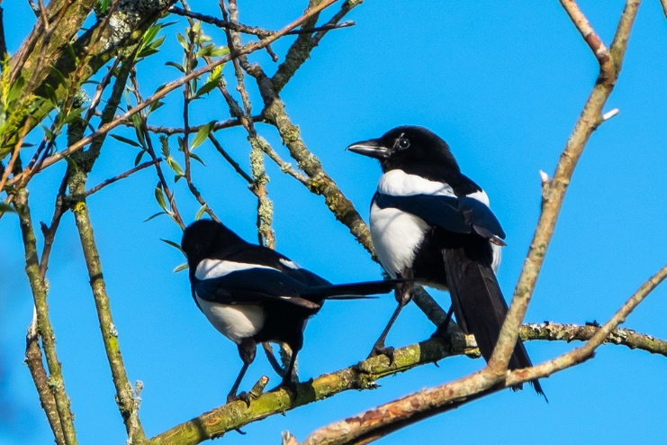
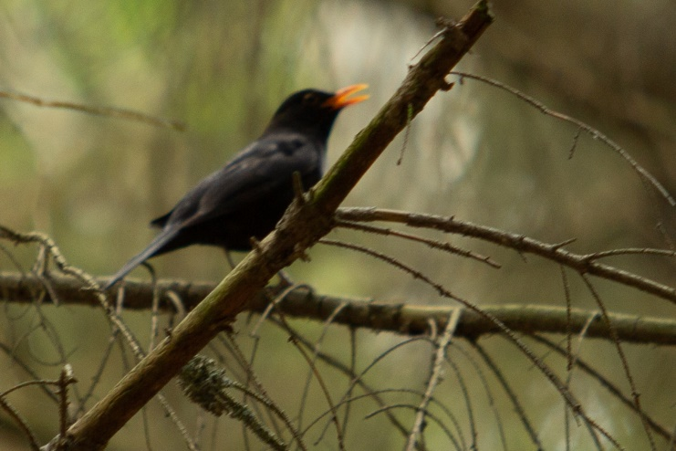
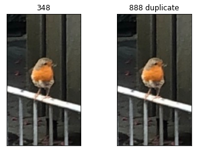
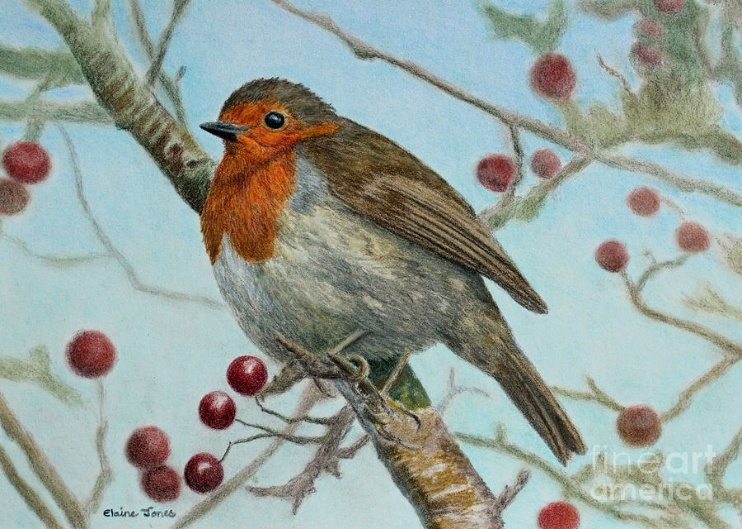
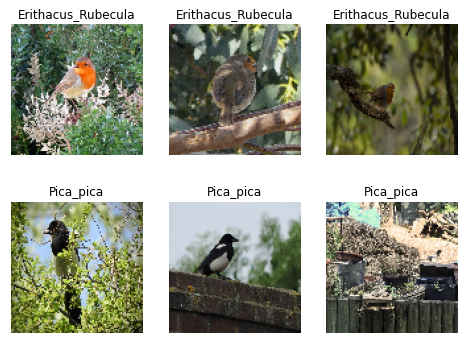
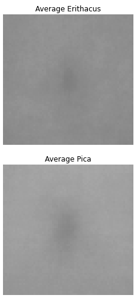
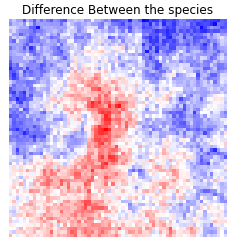
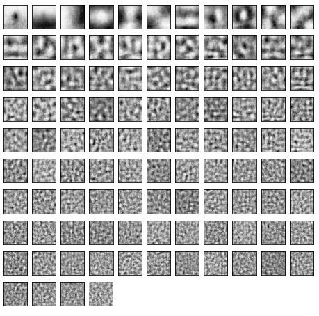

# Introduction 

Deep learning is a relatively recent machine-learning approach that uses
multiple layers of artificial neural networks to improve the performance
of typical machine-learning algorithms. With deep learning, complex
patterns can be identified and extracted more quickly than with
traditional methods. Moreover, deep learning models are often easier to
customize and tweak than those based on standard linear or logistic
regression models. Traditional machine-learning algorithms learn from
data by adjusting their parameters (weights) to make predictions for new
data. This process is repeated until the model achieves an acceptable
level of accuracy. However, this method is not suitable for highly
structured data sets such as images or text documents where different
parts might share similar features or characteristics. In these cases,
it's difficult for a single model to generalize across all instances
within a dataset without making incorrect assumptions about what
features are important and how they should be weighted relative to each
other. Therefore, deep learning allows computers to "learn" information
at a much deeper level than standard machine-learning models do by using
multiple layers of artificial neurons that can better adapt and
generalize across diverse datasets. Now days different classification
approaches are used. One way of classifying the birds is by using CNN
models to recognize each bird sound the main issue with this approach is
the lack of data. The more common way is classifying the birds’ using
images.

# Background

The aim is to craft a deep learning model capable of classifying
different bird species for the computer vision challenge hosted by BBC
Autunwatch. They wish to use a standard camera trap equipment. This
setup can provide images with a resolution of 1024 x 768. Since the
provided dataset contain different pictures the most logical guess is to
use Convolutional Neuronal Network.

# Methodology

In this section we will see how we can narrow our deep learning model
selection using data analysis. Data analysis is a fundamental step that
aims to improve the network accuracy. Exploratory Data Analysis, often
referred to as EDA is a technique used for deep learning that enables
you to explore and analyze unlabeled data. EDA can be used to improve
the accuracy of predictions made by deep neural networks, reduce bias in
training datasets, and identify relationships between features within
those datasets. There are many benefits to using EDA when performing
deep learning research:

- It allows you to explore nonlinear patterns in your data that could
  otherwise go unnoticed.

- It can help you find previously unknown variables or correlations that
  may impact your model's performance.

By identifying hidden structure in your data, you can more easily
develop models that generalize well across different instances or
samples of the same dataset. When training a deep learning model, it is
important to have enough data for the network to learn from. However,
sometimes there is not enough good data available for training purposes.
In this case, exploratory data analysis can be used to extract
information from the limited dataset in order not only find patterns and
insights but also create new or improved training datasets. The first
step in using exploratory data Analysis is identifying factors that are
important for the model you are trying to build. You can do this by
randomly sampling points in your dataset and plotting them against each
other or by performing correlation analyses between different variables.
In \[1\] Mehrdad describe the general pipe for EDA as extracting
features from the dataset and then visualizing it. Also, the
visualization help validate the features extrication method and refine
the questions. However, even if the EDA concept is the same for
different datasets, the methodology is different when applied to images
or documents. Researchers have different ways of dealing with the images
data analysis. There are multiple technics from a dedicated libraries
such as edapy \[2\], to different approaches such as the idea of using
the image instead of dots on chars for visualizing images from Lev
Manovich. For our dataset we have birds’ images cleaved into 4 different
classes, each class represent a different bird species. We have the
Erithacus Rubecul Fig. 1, Periparus ater Figure 2, Pica pica Figure 3
and Turdus Merula Figure 4.

Figure 1

Figure 2

> Figure 3

Figure 4

The first step for the Exploratory data analysis is:

## Data Recognition 

Prior to data cleaning, we go through each image of the dataset manually
to recognize the object of interest. By looking to the provided dataset
and its metadata such a resolution of the images, color palate, object
of interest, the environment, and the size of the datasets. We can
easily conceptualize and vision which architecture fits the best and
wherever use a gray color scale or a colored image.

## Data cleaning

Images can be a major source of data pollution, cluttered files, and
incorrect information. To clean your images properly, you first need to
identify the types of image data that you are dealing with. There are
two main types of image data: pixel data and vector data. Pixel data is
composed of colors (or other values), while vector data includes curves,
lines, paths, or shapes. In our case we are dealing with pixel data we
had to go through 4000 images of birds, with 1000 photographs for each
class of bird. We ended up taking off 105 images in total. Most of them
were nonconform to the class specie, nonrepresentative of the object of
interest and some of them were too blurry and noisy, aiforbirds.com was
used to validate wherever the images belong to the right class. We
decided to keep most of the noisy and blurry pictures, since we can
preprocess them using different noise reduction algorithms. Furthermore,
this type of images can increase the accuracy of our model during the
testing phase. In other hand where some researchers may delete
screenshots, we decided to stick with them, we will see in the data
balancing section that we added some blank images and paintings of the
different species. In addition, we removed the duplicates using
d-hashing algorithm, by comparing the hash of each image we can detect
the duplicate and remove it. Figure 5.

Figure 5

## Class Balance

In data science, the task of balancing training datasets is a critical
part of doing effective machine learning. This balance is necessary to
avoid overfitting or “tuning” the model too much, which can lead to poor
performance on future iterations of that same model. After a proper data
cleaning we usually end up with an unbalanced dataset. To balance the
data again we added photographs of specific species for each class,
paintings Figure 6, and some blank images. In addition, we also used
data augmentation which we are going to see further in this paper.

Figure 6

## Raw Comparison 

At this point we are starting to process the data; we are just going to
randomly display few images and compare them without any applied filter
or kernels Figure 7.

Figure 7

## Average Image

After converting all images of each class into a matrix, and in to order
to display the average image we must take the average value of each
pixel across all observations. We can see in Figure 8 the average image
for the Erithacus and Pica classes \[3\] .

Figure 8

## Contrast Between Average Images

Once the average image of each class acquired, we can use it to
calculate the difference between the classes. In Figure 9 we can observe
the contrast between the Erithacus Rubecula and the Pica Pica specie.
This is done simply by computing the difference between the mean of each
class, after that we plot the result using “bwr” color map.

Figure 9

## Eigenimages

Eigenimages are special because they allow us to optimize certain
parameters in a way that is specific to each data set. This improves the
accuracy and generalizability of our model, making it better able to
predict future data sets. It is a technique that aims to reduce the
dimensionality of our dataset and help generate common patterns. It is
also called eigenfaces as this approach was first used for facial
recognition research \[3\], we can see the eigenimages in Figure 10.

Figure 10

## Data Augmentation

Data augmentation is a technique that can be used in deep learning to
improve the accuracy of predictions. It involves training a model on
data that has been augmented with additional information. This extra
information may come from features extracted from images, text, or other
data sources. The benefits of data augmentation are manifold. It helps
to prevent overfitting – a problem that often results when artificial
intelligence (AI) models are trained using only raw input data without
any kind of pre-processing or feature extraction. Overfitting leads to
models that are too narrowly tailored to specific examples rather than
generalizable enough for future use. Augmenting the training dataset can
boost performance by introducing new types of relationships and patterns
into the neural network which were not present in the original data set.
In addition, we also have the synthetic data approach which consist of
using Generative Adversarial Networks to produce an artificially data
without relying on real word images. For our research we used TensorFlow
image data generator and applied different settings such as fleeing,
rotation, and shifting to create new images based on our originally
dataset.

## Data Tagging

In pursuit of a high efficiency prediction and low loss value the data
was tagged manually using Label Studio \[4\]. Each of the 4000
photographs were manually checked and labeled rather then using a
machine learning algorithm that can sort the data automatically. This
approach can lead to a bad labeling and object detection which can often
decrease the prediction results and the accuracy rate of the model.

## Model Architecture selection 

After analyzing the data our choice went towards the Faster R-CNN, and
there are multiples reasons that backup our decision. Faster R-CNN is a
type of deep learning model that uses recurrent neural networks. It has
become one of the most popular models for object recognition due to its
speed and accuracy. Faster R-CNN is an extension of its predecessor the
Fast R-CNN. In addition to the already existing object detection net and
ROI polling layer we have the region proposal network (RPN) that has
been added. The older R-CNN and Fast R-CNN were depending on the
selective search algorithm for generating the regional proposal which
takes a long of time to be processed. With the new Faster R-CNN the RPN
guides the Fast R-CNN detection module to where to look for objects in
the images \[5\]. This approach decreases the usual processing time and
increase the model accuracy. The RPN can be fully customized according
to the detection task, this concept is important for our classification,
knowing that we have a difficult classification but also a sensitive
dataset. Most of the time the birds are far in the perspective and
hidden behind weeds and branches. Being able to detect the right bird
specie can be challenging even for human experts. The RPN module can
help the classifier to process the important section of the images and
gain a tremendous processing time. Since the proposal is generated using
a network it can be trained end-to-end using backpropagation and
stochastic gradient descent \[6\]. In addition, Faster R-CNN can achieve
high performance quickly by leveraging the power of GPUs. This makes it
ideal for tasks such as image classification and object detection where
speed is critical. Furthermore, we are aiming in future works to create
a real time mobile bird detection app connected directly to the backend
through a rest-API. Faster R-CNN is the most suited architecture for
this specific task when speed is the absolute metric.

Identify applicable funding agency here. If none, delete this text box.

# Discussion

During this study one of the major concerns was to find the right
approach and the best suited solution for the bird classification task.
Before even thinking about the model architecture, we had to deal with
dataset preprocessing which represent a fundamental step in crafting the
most accurate model for the detection. The main issue was the lack of
aim regarding the right approach for our specific images. Most of the
research in this area are dedicated to a general preprocessing approach,
only few related works scratched that topic. In consequence our first
challenge was to gather relevant EDA techniques that can get the best
value out of our dataset. In addition, this classification task is a
complex process even for an expert eye. Sometimes the birds are too far
in the field of view or hidden in trees, this can be hard for the
network object detection module to differentiate between the object of
interest and the background. Which means that such a complex
classification needs more data training sets. We assume that 1000
photographs for each class is not enough to achieve a high efficiency
rate. This lack of data can lead to poor results or unusable model. This
is due to the similarities between the different species. Having a model
with a low accuracy rate is not ideal in this case. However, we believe
that using Faster R-CNN with this data analysis can perform at a high
rate and give good results. With the right hyperparameters and more data
we can expect to achieve a state of art classifier with real time
detection.

# Future Work

After preparing the data we are looking forward to start training the
Faster R-CNN model and test it on real world data. In addition, we will
use EfficientNet-Lite0 as a second architecture. According to Srijani
and al, EfficientNet-Lite0 has a model accuracy of 98.61 percent on bird
species classification with zero extra time, runed over a mobile without
using internet \[7\]. Since our aim is to create a web platform and
mobile app bird classifier this would be the perfect comparison to
achieve a state of art bird species IRL classifier. Furthermore, we will
train the model using new data with more classes to improve the model
performance.

##### References

\[1\] Mehrdad Yazdani, *Using Exploratory Data Analysis to Discover
Patterns*, (2016).

\[2\] Martin Thoma, “edapy.”

\[3\] Eunjoo Byeon, “Exploratory Data Analysis Ideas for Image
Classification.”

\[4\] Max Tkachenko, “Label Studio .”

\[5\] Ahmed Fawzy Gad, “Faster R-CNN Explained for Object Detection
Tasks.”

\[6\] Shaoqing Ren, Kaiming He, Ross Girshick, and Jian Sun, “Faster
R-CNN: Towards Real-Time Object Detection with Region Proposal
Networks”.

\[7\] Srijan, Samriddhi, and Deepak Gupta, “Mobile Application for Bird
Species Identification Using Transfer Learning”.

 
